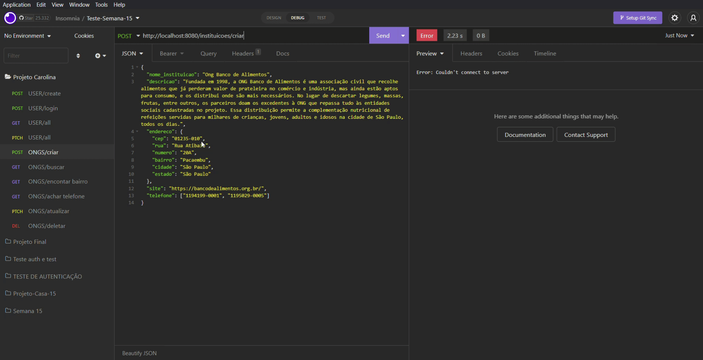
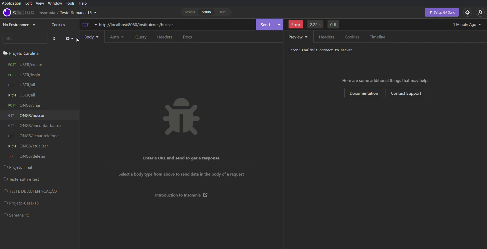
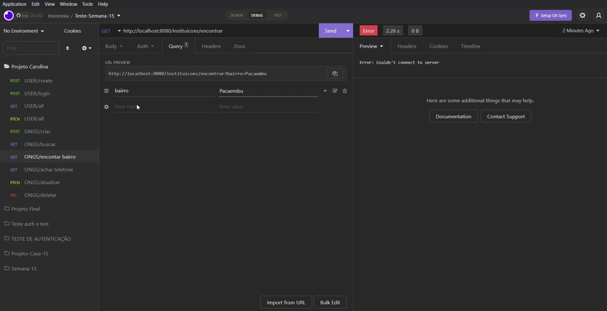
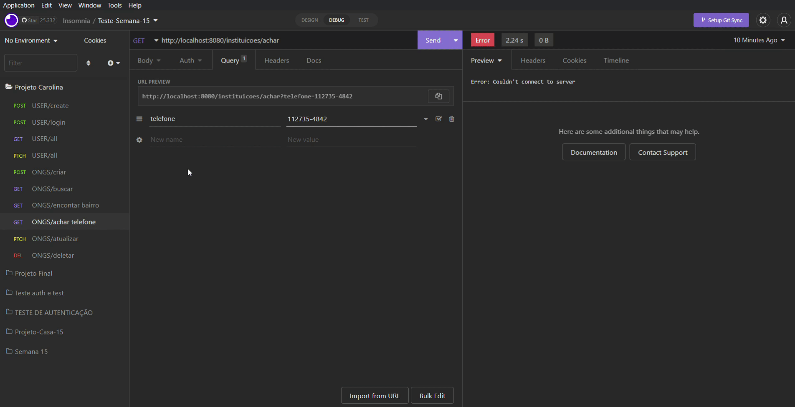
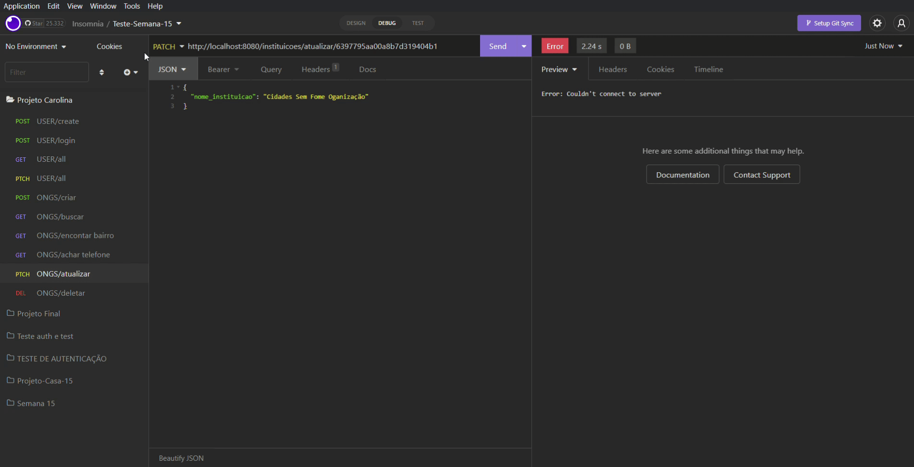
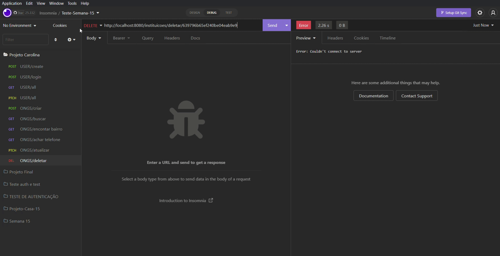
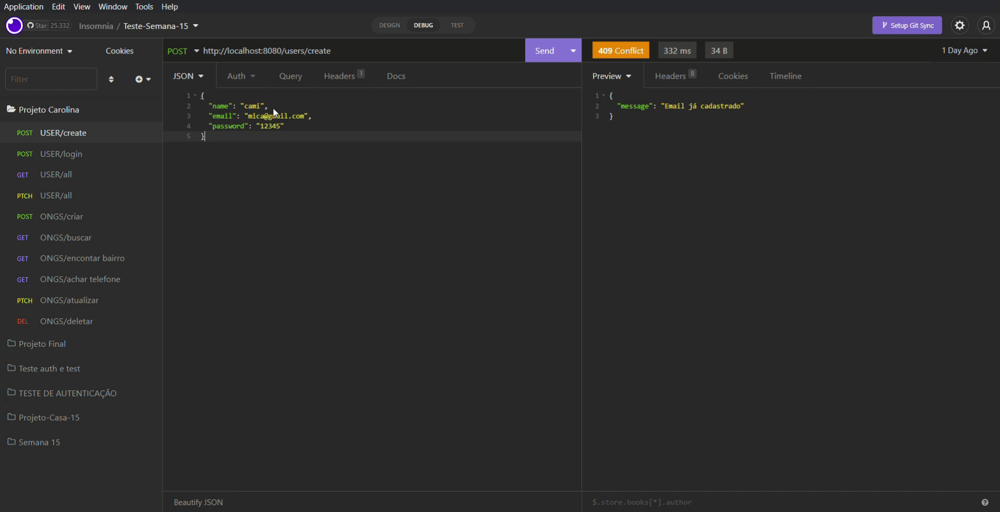
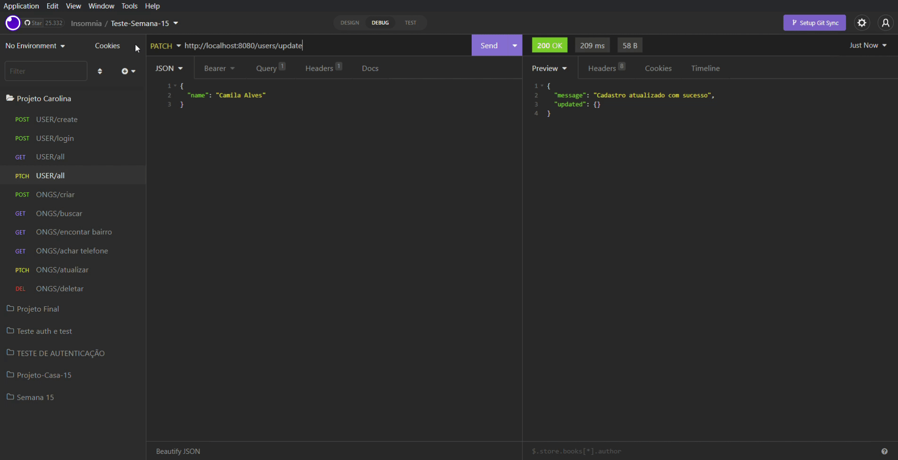
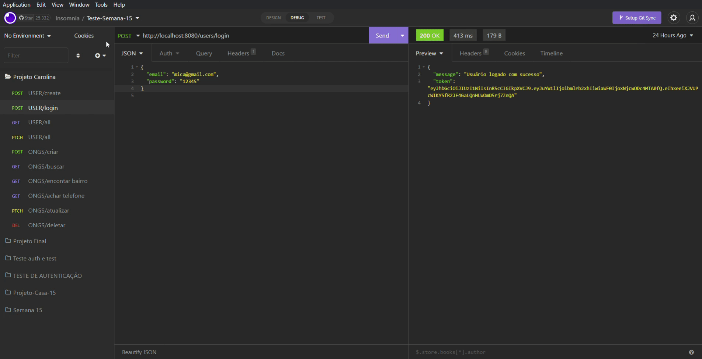
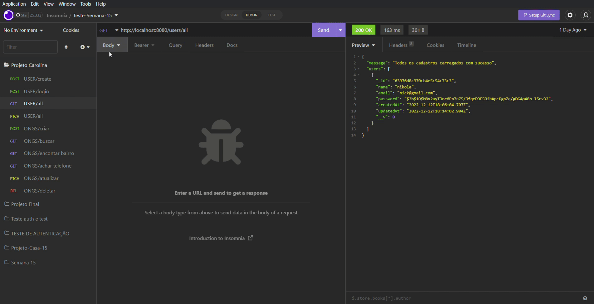

#  PROJETO CAROLINA MARIA DE JESUS

<div align="center">
 
</div>

##
# 🌻 UM POUCO SOBRE A APLICAÇÃO 
<p align="justify">
O projeto Carolina Maria de Jesus é uma aplicação que reúne informações sobre Ongs ou Instituições que ajudam famílias em situação de extrema pobreza e/ou insegurança alimentar. A ideia da aplicação é reunir informações como nome da instituição, endereço, telefone para contato e site dessas instituições, de maneira que as famílias que se encontram vulneráveis possam, em um primeiro momento, entrar em contato e serem ajudadas. 

##
# 📚 JUSTIFICATIVA
<p align="justify">
Este projeto foi inspirado em duas ou mais histórias diferentes, sendo elas: a história de Carolina Maria de Jesus, escritora negra e catadora de papel, que sobrevivia daquilo que encontrava pelas ruas de São Paulo e foi quem me forneceu a inspiração para o nome da aplicação; na vida dos meus pais que um dia já passaram por um contexto de estar em uma situação em que eles tinham pouco ou nada para comer; e, com certeza, essa aplicação também não poderia deixar de estar apoiada na vida dos mais de 30 milhões de brasileiros e brasileiras que hoje passam fome e que vivem a incerteza de não de ter a sua alimentação diária garantida.
De acordo com os dados da Rede Brasileira de Pesquisa em Soberania e Segurança Alimentar e Nutricional (Rede Penssan), as pessoas no Brasil que se encontram em situação de fome chegam à soma de 33,1 milhões, no ano de 2022. Portanto, esta aplicação busca, no mínimo, trazer algum alívio para as famílias que se encontram desamparadas em um momento de angústia.

##
# ⚙️ FUNCIONALIDADES
PARA O PÚBLICO EM GERAL É POSSÍVEL: 
 - listar todas as instituições
 - buscar cadastros por nome da instituição
 - buscar por bairro
 - buscar por telefone
 
PARA USUÁRIOS AUTENTICADOS É POSSÍVEL
- criar um novo cadasto 
- atualizar um cadastro já existente
- excluir um cadastro
- fazer todas as buscar já incluídas para o público em geral

##
# 🔧 ARQUITETURA
<p align="justify">
A arquitetura utilizada para este projeto foi padrão de arquitetura MVC ou Model View Controller, que separa a aplicação em três camadas. Neste caso, cada inicial representa as palavras Model View Controller, mas como esta aplicação foi pensanda inicialmente apenas pelo lado do back-end, ainda não há uma camada pensada para a View, que é a interação com o usuário, porém há as rotas ou routes. 

``` 
  📁 PROJETO-FINAL2
   |
   |---📁 assets
   |
   |---📁 src
   |    |
   |    |-- 📁 config
   |    |    |--📄 database.js
   |    |-- 📁 controllers
   |    |    |--📄 authController.js
   |    |    |--📄 instituicoesController.js
   |    |    |--📄 userController.js
   |    |-- 📁 middlewares
   |    |    |- 📄 auth.js
   |    |-- 📁 models
   |    |    |--📄 InstituicoesModel.js
   |    |    |--📄 UserModel.js
   |    |-- 📁 routes
   |    |    |--📄 indexRoutes.js
   |    |    |--📄 instituicoesRoutes.js
   |    |    |--📄 userRoutes.js  
   |    | 
   |    |--📄 app.js
   |
   |- 📄 .env
   |- 📄 .env.example
   |- 📄 .gitignore
   |- 📄 doc.md
   |- 📄 package-lock,json
   |- 📄 package.json
   |- 📄 README.md
   |- 📄 server.js
   |- 📄 vercel.js

```

##
# 🖥️ TECNOLOGIAS E PACOTES UTILIZADOS
TECNOLOGIAS:
- [Git/GitHub](https://github.com/)
- [Vercel](https://vercel.com/)
- [JavaScript](https://www.javascript.com/)
- [MongoDB Atlas](https://www.mongodb.com/cloud/atlas)
- [Node.js](https://nodejs.org/en/)
- [Postman](https://www.postman.com/)
- [VScode](https://code.visualstudio.com/)  

PACOTES:
- [Cors](https://www.npmjs.com/package/cors)
- [Dotenv](https://www.npmjs.com/package/dotenv)
- [Express](https://expressjs.com/pt-br/)
- [Mongoose](https://mongoosejs.com/)
- [Nodemon](https://www.npmjs.com/package/nodemon)
- [Bcrypt](https://www.npmjs.com/package/bcrypt)
- [Jsonwebtoken](https://www.npmjs.com/package/jsonwebtoken)

##
# 🔃 ROTAS
## MÉTODOS: POST/GET/PATCH/DELETE

| Método HTTP  | Endpoint                     | Descrição                            |
| ------------ | ---------------------------- | ------------------------------------ |
| GET          | `http://localhost:PORT/`     |  Apresentação do projeto    |        |


## 🔃 ROTAS - INSTITUIÇÕES

| Método HTTP  | Endpoint              | Descrição                                  |
| ------------ | --------------------- | ------------------------------------------ |
| GET          | `/instituicoes/buscar`| Lista todos as instituições cadastradas    |
| GET          | `/instituicoes/encontrar`| Filtra as instituições pelo bairro buscado   |
| GET          | `/instituicoes/achar`    | Filtra as instituições pelo telefone buscado   |
| POST         | `/instituicoes/criar`         | Cria um novo cadastro               |
| PATCH        | `/instituicoes/atualizar/:id`   | Atualiza o cadastro de alguma instituição por ID  |
| DELETE       | `/instituicoes/deletar/:id`     | Deleta um cadastro por ID  |      

## 🔃 ROTAS - USERS

| Método HTTP  | Endpoint              | Descrição                                  |
| ------------ | --------------------- | ------------------------------------------ |
| GET          | `/users/all`          | Lista os usuários cadastrados              |
| POST         | `/instituicoes/create`         | Cria um novo cadastro de usuário     |
| POST         | `/instituicoes/login`             | Faz o login na aplicação          |
| PATCH        | `/instituicoes/update`   | Atualiza o cadastro de algum usuário  |

##
# 📑 DOCUMENTAÇÃO
## Instituições

```
[POST] "/instituicoes/criar"
- 400: erro para a não inclusão do nome_instituicao
- 400: erro para a não inclusão da descricao
- 400: erro para a não inclusão do endereco
- 400: erro para a não inclusão do telefone
- 400: erro para a não inclusão do site
- 400: erro para um telefone já cadastrado no banco de dados
- 201: cadastro criado com sucesso
- 500: erro de servidor

[GET] "/instituicoes/buscar"
- 200: sucesso para o retorno de todos os cadastros
- 500: erro de servidor

[GET] "/instituicoes/encontrar"
- 200: sucesso para encontrar uma instituicao por bairro
- 500: erro de servidor

[GET] "/instituicoes/achar"
- 200: sucesso para achar uma instituicao por telefone
- 500: erro de servidor

[PATCH] "/instituicoes/atualizar/:id"
- 404: erro para quando id não foi encontrado
- 200: sucesso para atualizar um cadastro
- 500: erro de servidor

[DELETE] "/instituicoes/deletar/:id"
- 404: erro para quando id digitado não foi encontrado
- 200: sucesso para deletar um cadastro pelo id
- 500: erro de servidor

```
## User

```
[GET] "/users/all"
- 200: sucesso para carregar todos os cadastros
- 500: erro de servidor

[POST] "/users/create"
- 400: erro para tentativa de cadastro de um email já existente
- 400: erro para tentativa de cadastro de um email sem o "@"
- 400: erro para tentiva de cadastro de um email sem o ".com"
- 201: sucesso ao criar um novo usuário
- 500: erro de servidor

[PATCH] "/users/update"
- 404: erro para usuário não encontrado
- 200: sucesso para atualizar cum cadastro
- 500: erro de servidor
```

## Auth / Login

```
[POST] "/users/login"
- 404: erro para usuário não encontrado
- 401: sem autorização; senha inválida
- 200: sucesso no login
- 500: erro de servidor
```


##
# ✔️ FUNCIONAMENTO

<br>

>Cadastrando uma Instituição
<div align = "center">



</div>
<br>

>Buscando por todos os cadastros
<div align = "center">



</div>
<br>

>Buscando cadastro por bairro
<div align = "center">



</div>
<br>

>Buscando cadastro por telefone
<div align = "center">



</div>
<br>


>Atualizando um cadastro
<div align = "center">



</div>
<br>


>Deletando cadastro
<div align = "center">



</div>
<br>


>Criando um usuário
<div align = "center">



</div>
<br>


>Atualizando um usuário
<div align = "center">


</div>
<br>


>Logando na aplicação
<div align = "center">



</div>
<br>


>Bucando por todos os cadastro de usuários
<div align = "center">



</div>
<br>